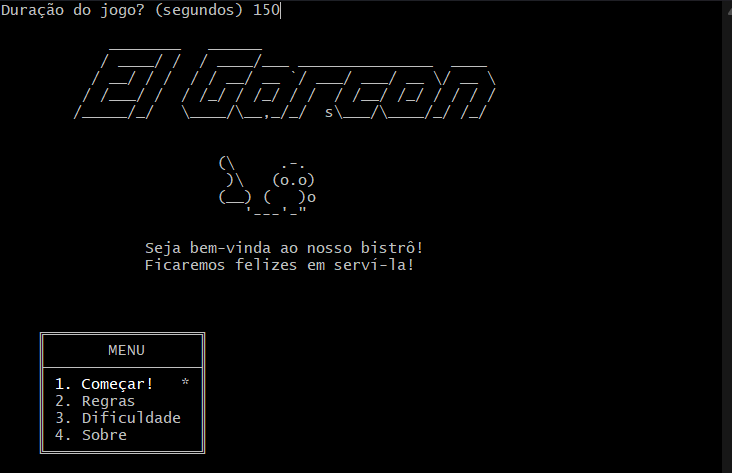

# Projeto Final

Aluno: Jorge Augusto Salgado Salhani

Nº USP: 8927418

## Jogo: El Garçon

### Introdução
O jogo "El Garçon" foi desenvolvido como trabalho final para a disciplina de [Sistemas Operacionais I](https://uspdigital.usp.br/jupiterweb/obterDisciplina?nomdis=&sgldis=SSC0140) para estudo (não somente, mas em especial) da utilização de threads e de suas estruturas de dados particulares, tais como semáforos, mutex, variáveis condicionais, variáveis atômicas, entre outros. Grande parte das referências utilizadas na construção do código podem ser encontradas em [cppreference](https://en.cppreference.com/w/cpp/thread), especialmente na descrição e exemplos de [mutex](https://en.cppreference.com/w/cpp/thread/mutex), [join](https://en.cppreference.com/w/cpp/thread/thread/join) e [condition_variable](https://en.cppreference.com/w/cpp/thread/condition_variable).

O código desenvolvido faz uso do modelo conhecido como Produtor-Consumidor, onde threads construídos competem por um espaço limitado de recursos (fila de tamanho máximo de pessoas, neste caso) e são responsáveis por adicionar em ou remover elementos de uma variável compartilhada ao longo do tempo

Neste jogo, o thread "Produtor" continuamente adiciona novas pessoas à fila e é papel de quem está jogando atuar como "Consumidor", removendo as pessoas da fila conforme seus nomes são digitados corretamente

### Organização (foco em threads)
Nesta seção explicamos o código desenvolvido, com ênfase às partes relacionadas ao uso de threads. Foram removidas todas as partes não dependentes de fluxos concorrente com threads para facilitar a visualização e compreensão de cada etapa

- Variáveis globais
```cpp
int MAX_PERSONS = 20;
float GAME_TOTAL_SCORE = 0.0;
int GAME_TOTAL_CORRECT_PERSON = 0;
auto GAME_INIT_TIME = steady_clock::now();
map<string, time_point<steady_clock>> START_TIMES;
vector<Person> PERSONS;
```

- Variáveis do tipo mutex
```cpp
mutex PERSONS_MUTEX;
mutex TIME_MUTEX;
mutex SCORE_MUTEX;
```

- Variáveis do tipo condicionais (semáforos)
```cpp
condition_variable 
    CONDITIONAL_VAR_PRODUCER,
    CONDITIONAL_VAR_CONSUMER;
```

- Variável do tipo atomica
```cpp
atomic<bool> IS_RUNNING(true);
```

A seguir temos a função main. Ela é responsável por 
1. inicializar dois threads, um vinculado à função producer (geração de novas pessoas) e outro vinculado à função consumer (remoção de pessoas)
2. Bloquear a execução (neste contexto) de um dos threads, com a finalização da função ocorrendo apenas na sinalização de final dos threads (join) e, com isso, manter em execução a produção de novas pessoas
3. Atomicamente sinalizar que o jogo finalizou. A variável IS_RUNNING é compartilhada, mas por ser atomica, o comportamento de escrita/leitura por multiplas threads é bem definido
4. Notificar (com mensagem para desbloqueio) todo thread dependente das variáveis condicionais COND_VAR_PROD / COND_VAR_CONS 
5. Bloquear cada thread até que estejam completas

```cpp
int main() {
    thread producer_thread(producer); // 1. inicializar 
    thread consumer_thread(consumer); // 1. inicializar
    this_thread::sleep_for(seconds(GAME_MAX_TIME)); // 2. bloquear por tempo definido
    IS_RUNNING = false; // 3. sinalizacao atomica
    CONDITIONAL_VAR_PRODUCER.notify_all(); // 4. desbloquear espera condicional (semáforo) 
    CONDITIONAL_VAR_CONSUMER.notify_all(); // 4. desbloquear espera condicional (semáforo)
    producer_thread.join(); // 5. Bloquear até finalização
    consumer_thread.join(); // 5. Bloquear até finalização
    return 0;
}
```

A seguir temos a função consumidor. Ela é responsável por
1. Acessar de forma exclusiva (mutex) a variável PERSONS, que contém a lista de pessoas de onde serão removidas cada pessoa
2. Aguardar para consumir novas pessoas apenas caso o vetor PERSONS não esteja vazio
3. Atualizar o tempo transcorrido para cada pessoa no vetor PERSONS e START_TIMES. 
4. Atualizar a pontuação global e remover (consumir) do vetor PERSONS uma determinada pessoa

Aqui vale ressaltar que os mutex lock_time e lock_score poderiam não existir, mantendo como região de mutex apenas lock_persons. Mantivemos como didática para segregar a dependência de cada variável de uso compartilhado

5. Notificar para que alguma thread (arbitrariamente) em execução que esteja esperando pela variável condicional COND_VAR_PROD (e sinalizar que o vetor PERSONS teve um espaço liberado)
6. Bloquear a execução deste thread por um tempo definido, para simular um comportamento menos instantaneo na visão da pessoa que joga


```cpp
void consumer() {
    while (IS_RUNNING) {
        unique_lock<mutex> lock_persons(PERSONS_MUTEX); // 1. bloqueio de contexto mutex
        CONDITIONAL_VAR_CONSUMER.wait(lock_persons, []() { return !PERSONS.empty(); }); // 2. espera condicional
        if (!IS_RUNNING) break; 
        {
            unique_lock<mutex> lock_time(TIME_MUTEX); // 3. bloqueio de contexto mutex para atualização do tempo transcorrido
            CheckElapsedTime();
        }
        {
            unique_lock<mutex> lock_score(SCORE_MUTEX); // 4. bloqueio de contexto mutex para atualização de SCORE e remoção de item *it do vetor PERSONS
            updateScore(*it);
            PERSONS.erase(it);
            GAME_TOTAL_CORRECT_PERSON++;
        }
        CONDITIONAL_VAR_PRODUCER.notify_one(); // 5. notificação de liberação de um espaço para nova produção
        this_thread::sleep_for(milliseconds(500)); // 6. espera definida
    }
}
```

A seguir temos a função produtora. Ela é responsável por
1. Bloquear esta região para acesso exclusivo - mutex - ao vetor PERSONS (que terá a ele um elemento adicionado ao final)
2. Aguardar de modo condicional (semáforo) para que somente seja produzida nova pessoa caso o vetor não tenha atingido um limite pré definido
3. Gerar uma nova pessoa
4. Bloquear região mutex para inserção no vetor START_TIMES da nova pessoa criada
5. Caso um número fixo de pessoas seja criado, aguardar thread por tempo definido. Vale apenas para que ao início do jogo não tenhamos muitas pessoas "instantaneamente"
6. Notificar para que alguma thread (arbitrariamente) em execução que esteja esperando pela variável condicional COND_VAR_CONS (e sinalizar que o vetor PERSONS teve um espaço preenchido)

Similar ao mencionado na função anterior, bastaria o bloqueio de acesso por um semáforo mutex (por exemplo, o primeiro lock_persons), mas mantivemos um para cada variável compartilhada

```cpp
void producer() {
    int person_id = 1;
    while (IS_RUNNING) {
        unique_lock<mutex> lock_persons(PERSONS_MUTEX); // 1. bloquear região mutex
        CONDITIONAL_VAR_PRODUCER.wait(lock_persons, []() { return (int) PERSONS.size() < MAX_PERSONS; }); // 2. espera condicional (semáforo) para limitar produção
        if (!IS_RUNNING) break;
        Person new_person = generatePerson(person_id++); // 3. gerar nova pessoa
        {
            unique_lock<mutex> lock_time(TIME_MUTEX); // 4. bloqueio de região mutex
            START_TIMES[new_person.name] = steady_clock::now();

            PERSONS.push_back(new_person);
        }
        if (PERSONS.size() >= 8)
          this_thread::sleep_for(seconds(1)); // 5. espera definida
        CONDITIONAL_VAR_CONSUMER.notify_one(); // 6. notificação de variavel condicional
    }
```

### Como jogar
Abaixo explicamos como pode ser feita a execução do código e instruções de como jogar

#### Executando
O jogo foi desenvolvido para windows (via [Cygwin](https://cygwin.com/cygwin-ug-net/using.html)) e pode apresentar erros caso operado em sistemas unix ou iOS

Estando na raiz do projeto ('operatingSystems1')

1. Caminhar ao local do arquivo fonte
```bash
cd apoteose/src
```

2. Construir executável
```bash
make
```

3. Executar programa criado
```bash
make run
```

Alternativamente, basta executar programa disponibilizado em
```bash
apoteose\src\exec.exe
```

#### Jogando

A inicialização do jogo resulta na imagem abaixo


Nela podem ser selecionados os valores 1, 2, 3, 4. Qualquer das opções selecionadas resulta na marcação conforme mostrado abaixo. Caso confirmado "s", somos direcionados à página relativa à opção


##### Sobre
A opção 4 nos leva à história do jogo. Para retornar ao menu inicial, basta digitar qualquer tecla conforme indicado no topo da tela


##### Regras
A opção 2 nos leva às regras do jogo. Para retornar ao menu inicial, basta digitar qualquer tecla conforme indicado no topo da tela


##### Dificuldades
A opção 3 nos leva às dificuldades do jogo. Nesta tela devemos selecionar 1, 2, 3 de acordo com a dificuldade desejada


##### Jogar
Por fim a opção 1 nos leva ao início de fato do jogo. Após confirmação da opção 1 somos direcionados à pergunta da duração do jogo, conforme o topo da imagem abaixo. Nela informamos qual o tempo máximo (em segundos) que uma determinada pessoa pode esperar na fila. O jogo acaba quando esse número é atingido por alguma das pessoas



Ao iniciar o jogo, algumas pessoas já terão sido geradas conforme imagem abaixo. Sua função é digitar, conforme o topo da tela, o nome da pessoa a ser atendida


No exemplo abaixo inserimos o nome "Luan Augusto", que foi removido da lista ao apertarmos a tecla ENTER. A pontuação e o tempo são incrementados conforme calculado. Neste caso estamos na dificuldade 2, onde é necessário digitarmos "Nome" + " " + "Sobrenome". Como digitamos corretamente, a pessoa escolhida é removida da lista, uma nova é gerada e inserida ao final.


Caso o nome não seja digitado corretamente, tal como a imagem abaixo, a pontuação é mantida e também uma nova pessoa é inserida na fila


Ao final do jogo, as pontuações e métricas são exibidas na tela, conforme imagem abaixo


Caso a dificuldade escolhida seja 3, após a digitação correta do nome e sobrenome, cada pessoa apresenta uma mensagem personalizada que deverá ser inserida no pedido


Apenas com a inserção correta da frase é que a pessoa é removida da fila conforme imagens abaixo onde a pessoa escolhida foi "Madonna Tadeu"


E a final, mostramos também o resultado do jogo atual


